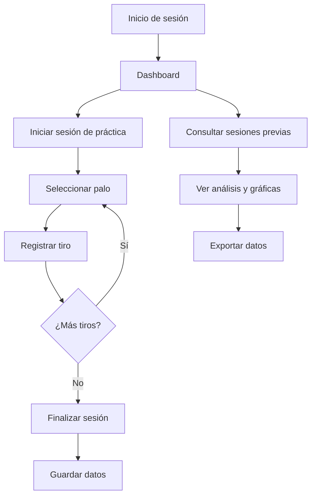

# Contexto Inicial del Proyecto: SGS Golf

## Solicitud Original
Iniciar la planeación de una app para Android con Flutter para registrar sesiones de práctica de golf, enfocada en distancias de juego corto, con interfaz moderna, intuitiva y divertida. Flujo de trabajo basado en tareas convertidas a issues de GitHub, branches main/develop y uno por tarea, uso exclusivo de librerías actualizadas y estables.

## Documento de Requerimientos del Producto (PRD)
Referencia: `devgolf/sgs_golf/docs/tasks/prd-sgs-golf.md`

## Notas
- El desarrollo se realizará exclusivamente en la carpeta `devgolf/sgs_golf`.
- El equipo de desarrollo es un solo usuario asistido por IA.
- En una segunda etapa se incluirán las métricas `spinrate` y `angleofattack`.

Este archivo servirá como contexto principal para la siguiente fase de levantamiento de requerimientos.

---

# Requerimientos Detallados SGS Golf

## 1. Objetivo de Negocio y Criterios de Éxito
- Digitalizar el registro de prácticas de golf corto.
- Éxito medido por reducción de errores y mayor control de datos.

## 2. Análisis de Situación Actual
- No existe registro sistemático; los usuarios dependen de memoria o notas dispersas.
- Problemas: pérdida de información, falta de seguimiento, imposibilidad de análisis comparativo.

## 3. Usuarios Objetivo
- Jugadores avanzados de cualquier edad, familiarizados con apps deportivas.
- Necesitan análisis detallado y comparativas de su desempeño.

## 4. Restricciones y Expectativas
- Desarrollo exclusivo en carpeta `devgolf/sgs_golf`.
- Uso de Flutter para Android.
- Solo librerías estables y actualizadas.
- Protección básica de datos personales.
- Escalabilidad para agregar nuevas métricas en el futuro.

## 5. Escenarios y Flujos Clave
- Registro de usuario y autenticación.
- Inicio de sesión.
- Flujo de práctica: selección de palo (PW, GW, SW, LW), registro de tiros y distancias, cambio de palo, finalización y guardado de sesión.
- Consulta de sesiones previas.
- Análisis de resultados: promedios, consistencia, comparativas por palo y sesión.
- Exportación de datos.

## 6. Requerimientos Funcionales

### 6.1. Registro y Autenticación
- El usuario podrá crear una cuenta y autenticarse mediante usuario y contraseña.
- Validación de datos mínimos para registro.

### 6.2. Gestión de Sesiones de Práctica
- Selección de palo antes de cada tiro (PW, GW, SW, LW).
- Registro de distancia (yardas) para cada tiro.
- Botón para guardar cada entrada.
- Contador de tiros realizados por palo.
- Cambio de palo durante la sesión.
- Finalización de sesión y guardado de todos los datos.

### 6.3. Consulta y Análisis
- Acceso a historial de sesiones previas.
- Visualización de promedios de distancia por palo y sesión.
- Gráficas comparativas por palo y sesión.
- Métricas prioritarias: promedio y consistencia.
- Opción de exportar datos (CSV, PDF u otro formato estándar).

### 6.4. Dashboard
- Acceso centralizado a sesiones, análisis y exportación.

## 7. Requerimientos No Funcionales

### 7.1. Usabilidad
- Interfaz intuitiva, moderna y ágil.
- Experiencia divertida y fácil de usar.
- Paleta sugerida: naranja, azul, verde y gris.

### 7.2. Seguridad y Privacidad
- Protección básica de datos personales.
- Almacenamiento seguro de credenciales.
- Opción de eliminar cuenta y datos asociados.

### 7.3. Escalabilidad y Mantenibilidad
- Estructura modular y código documentado.
- Facilidad para agregar nuevas métricas (ej. spinrate, angleofattack).
- Soporte para crecimiento de usuarios y datos.

### 7.4. Calidad y Procesos
- Uso de librerías estables y actualizadas.
- Integración con GitHub Actions para pruebas y control de calidad.
- Flujo de trabajo basado en branches y PRs.

## 8. Dependencias y Consideraciones
- El equipo es un solo usuario asistido por IA.
- Planeación y desarrollo en carpeta `devgolf/sgs_golf/`.
- Futuras métricas: spinrate y angleofattack.
- No hay restricciones regulatorias adicionales.

## 9. Criterios de Aceptación
- Reducción de errores en registro y análisis.
- Mayor control y trazabilidad de datos.
- Facilidad de uso y adopción por usuarios avanzados.
- Capacidad de análisis comparativo y exportación de datos.

## 10. Visualizaciones y Reportes
- Gráficas comparativas y tablas de promedios/consistencia.
- Exportación de datos como funcionalidad clave.

## 11. Escenarios de Uso (Mermaid)



---

## Blueprint Técnico Detallado — SGS Golf

### 1. Estructura de Carpetas y Archivos Propuesta

La estructura propuesta maximiza la modularidad, escalabilidad y mantenibilidad, alineada con el stack Flutter/Hive y las mejores prácticas para apps local-first:

```
devflow/
└── sgs_golf/
    ├── lib/
    │   ├── main.dart
    │   ├── app.dart
    │   ├── core/           # Configuración, utilidades, constantes, temas
    │   ├── data/           # Modelos, fuentes de datos (Hive), repositorios
    │   ├── features/       # Un subdirectorio por feature principal
    │   │   ├── auth/       # Registro, login, autenticación local
    │   │   ├── practice/   # Lógica y UI de sesiones de práctica
    │   │   ├── dashboard/  # Visualización de sesiones previas
    │   │   ├── analysis/   # Análisis y comparativas
    │   │   └── export/     # Exportación de datos (CSV)
    │   ├── shared/         # Widgets y utilidades reutilizables
    │   └── l10n/           # Internacionalización (si aplica)
    ├── test/               # Pruebas unitarias y de widgets
    ├── .github/
    │   └── workflows/      # GitHub Actions (CI, formateo, pruebas)
    ├── pubspec.yaml        # Dependencias y configuración Flutter
    └── README.md
```

**Justificación:**  
- Cada feature es autocontenida, facilitando desarrollo incremental y pruebas.
- `data/` centraliza modelos y lógica de persistencia.
- `shared/` promueve reutilización y consistencia visual.
- Estructura alineada a flujos de trabajo colaborativos y asistidos por IA.

---

### 2. Especificación de Módulos y Responsabilidades

#### 2.1. Módulos Principales

- **core/**  
  Configuración global, temas, utilidades, constantes, helpers.

- **data/**  
  - Modelos de dominio (sesión, tiro, usuario).
  - Adaptadores Hive y lógica de persistencia.
  - Repositorios para acceso y manipulación de datos.

- **features/**  
  - **auth/**: Registro, login, autenticación local, gestión de usuario.
  - **practice/**: Flujo de registro de tiros, selección de palo, finalización de sesión.
  - **dashboard/**: Listado y detalle de sesiones previas.
  - **analysis/**: Gráficas, comparativas, métricas de consistencia y progreso.
  - **export/**: Exportación de datos a CSV, integración con sistema de archivos.

- **shared/**  
  Widgets reutilizables (inputs, botones, cards, selectores), estilos y utilidades UI.

- **l10n/**  
  Archivos de internacionalización (opcional, si se requiere multilenguaje).

#### 2.2. Dependencias Clave

- `flutter`, `hive`, `hive_flutter`, `provider` o `riverpod`, `csv`, `flutter_test`, `intl` (opcional), `flutter_lints`.

#### 2.3. Puntos de Integración

- **Persistencia:**  
  Todos los features interactúan con `data/` vía repositorios.
- **Gestión de estado:**  
  Uso de Provider/Riverpod para desacoplar UI y lógica.
- **Exportación:**  
  Módulo `export/` accede a datos procesados en `data/` y los transforma a CSV.
- **Autenticación:**  
  Local, sin backend, gestionada en `auth/` y referenciada por el resto de features.

---

### 3. Reglas de Modularidad y Colaboración Asistida por IA

- Lógica de negocio separada de presentación (no lógica en widgets).
- Archivos `.dart` ≤ 300 líneas (excepto modelos/configuración).
- Widgets y utilidades compartidas en `shared/`.
- Documentar cada módulo, función pública y ejemplo de uso.
- Issues y PRs deben incluir contexto, dependencias y ejemplos.
- Uso de plantillas y etiquetas para facilitar seguimiento por IA.
- Automatización de documentación y análisis estático recomendada.

---

### 4. Entregables y Siguientes Fases

- Implementación de la estructura de carpetas y módulos.
- Configuración de dependencias en `pubspec.yaml`.
- Plantillas base para cada feature (`auth`, `practice`, `dashboard`, `analysis`, `export`).
- Pruebas iniciales y configuración de workflows CI.
- Documentación de modelos, flujos y componentes UI.
- Ejemplos de uso y casos de prueba en cada módulo.

---

### 5. Estructura Inicial de UI y Navegación — SGS Golf

#### 5.1. Arquitectura de Navegación

La navegación se implementará mediante un stack de rutas basado en `Navigator 2.0` de Flutter, permitiendo navegación declarativa y control granular del historial. Se utilizará un esquema de rutas nombradas para facilitar la integración modular y pruebas. Justificación:
- Permite desacoplar la UI de la lógica de navegación.
- Facilita deep linking y futuras expansiones (por ejemplo, nuevas métricas o pantallas).
- Compatible con pruebas automatizadas y flujos de usuario complejos.

**Rutas principales propuestas:**
- `/login` — Pantalla de autenticación.
- `/register` — Registro de usuario.
- `/dashboard` — Inicio, listado de sesiones previas.
- `/practice` — Flujo de registro de tiros.
- `/analysis` — Visualización de comparativas y métricas.
- `/export` — Exportación de datos.

#### 5.2. Componentes Principales y Relación con Features

Cada feature tendrá su propio conjunto de pantallas y widgets, alineados a la estructura modular:
- **auth/**: Login, registro, recuperación de acceso.
- **practice/**: Selección de palo, registro de tiro, resumen y finalización de sesión.
- **dashboard/**: Listado de sesiones, acceso a detalle.
- **analysis/**: Gráficas, comparativas, métricas.
- **export/**: Pantalla y widgets para exportar datos.

Componentes transversales (en `shared/`):
- Barra de navegación inferior.
- Cards de sesión y tiro.
- Selectores de palo y distancia.
- Diálogos de confirmación y error.

#### 5.3. Propuesta de Carpetas y Archivos UI

```
lib/
├── main.dart
├── app.dart
├── core/
├── data/
├── features/
│   ├── auth/
│   │   ├── login_screen.dart
│   │   ├── register_screen.dart
│   │   └── widgets/
│   ├── practice/
│   │   ├── practice_screen.dart
│   │   ├── club_select_widget.dart
│   │   └── widgets/
│   ├── dashboard/
│   │   ├── dashboard_screen.dart
│   │   └── widgets/
│   ├── analysis/
│   │   ├── analysis_screen.dart
│   │   └── widgets/
│   └── export/
│       ├── export_screen.dart
│       └── widgets/
├── shared/
│   ├── bottom_nav_bar.dart
│   ├── session_card.dart
│   ├── club_selector.dart
│   └── dialogs/
└── l10n/
```

#### 5.4. Puntos de Integración y Recomendaciones de Modularidad

- Cada pantalla accede a datos y lógica a través de repositorios en `data/` y proveedores de estado (Provider/Riverpod).
- Los widgets en `shared/` deben ser completamente desacoplados de features específicos.
- La navegación debe centralizarse en un único archivo de rutas para facilitar mantenimiento y escalabilidad.
- Los flujos de autenticación y práctica deben ser independientes, permitiendo pruebas y desarrollo incremental.
- Se recomienda mantener los archivos `.dart` por pantalla/componentes ≤ 300 líneas.

#### 5.5. Entregables para Siguientes Fases

- Implementación de la estructura de carpetas y archivos UI.
- Plantillas base para cada pantalla y widget principal.
- Configuración inicial de navegación y rutas.
- Documentación de flujos de navegación y ejemplos de integración.
- Pruebas iniciales de navegación y renderizado de pantallas.
### 5. Diagrama de Integración General


---

### 6. Recomendaciones Técnicas y de Calidad

- Seguir el stack aprobado y convenciones de arquitectura local-first.
- Priorizar simplicidad, extensibilidad y pruebas automatizadas.
- Mantener documentación y ejemplos actualizados.
- Facilitar onboarding y colaboración asistida por IA.
- Planificar la evolución para futuras métricas (`spinrate`, `angleofattack`).

---

### 7. Riesgos y Consideraciones

- Riesgo bajo por no depender de backend externo.
- Escalabilidad prevista para futuras etapas.
- Seguridad limitada a autenticación local; reforzar en siguientes versiones si se expande el alcance.

---


